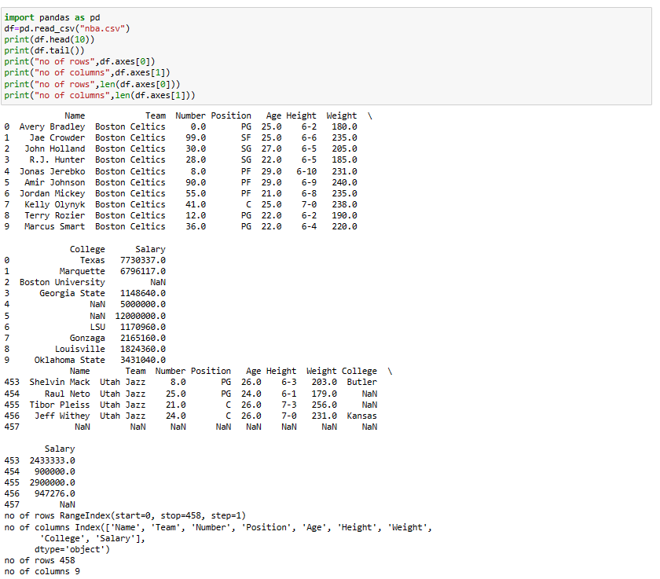

# Read-from-CSV

## AIM:
To write a python program to read contents from a CSV file.

## ALGORITHM:
# Step 1:
Import pandas module as pd.
# Step 2:
Using pd.read_csv() method read the CSV file.
# Step 3:
Using df.head() print the first 10 rows of the CSV file.
# Step 4:
Using df.tail() print the last 5 of the CSV file.
# Step 5:
Using len(df.axes[]) print the toal no.of rows and columns with argument 0 for row and argument 1 for column.

## PROGRAM:
```
program to read contents from CSV file
Developed By: Mani Sri Latha.M
Register Number: 212223110025
'''
import pandas as pd
df=pd.read_csv("nba.csv")
print(df.head(10))
print(df.tail())
print("no of rows",df.axes[0])
print("no of columns",df.axes[1])
print("no of rows",len(df.axes[0]))
print("no of columns",len(df.axes[1]))
```
## OUTPUT:

## RESULT:
Hence the program is executed successfully!